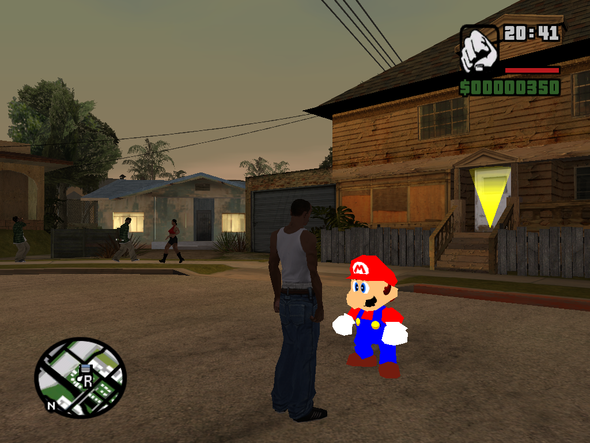

# sm64-san-andreas

An ASI plugin for GTA San Andreas, which makes use of [libsm64](https://github.com/libsm64/libsm64) to allow you to play as Mario from Super Mario 64.

This plugin requires the following in order to work:
* [Silent's ASI Loader](https://www.gtagarage.com/mods/show.php?id=21709)
* Super Mario 64 US ROM, with the filename `sm64.us.z64`, located in the GTA San Andreas folder alongside `gta_sa.exe`

This is still under development!

## Compiling
### Requirements
* [Code::Blocks with x86 (32-bit) MinGW compiler](http://www.codeblocks.org/downloads/binaries/#imagesoswindows48pnglogo-microsoft-windows) (codeblocks-mingw-32bit-setup.exe)
* [plugin-sdk](https://github.com/DK22Pac/plugin-sdk)
  * You only need to set environment variables for "Plugin-SDK folder" and "GTA San Andreas folder".
  * To create the Code::Blocks Plugin-SDK workspace, replace `tools\premake\premake5.exe` with [this version](https://github.com/DK22Pac/plugin-sdk/raw/cc130098120f45de0f62f34681555d7184719263/tools/premake/premake5.exe), otherwise it won't work

Make sure all of these are installed in a path that does not contain spaces, e.g. `C:\apps\CodeBlocks` instead of `C:\Program Files (x86)\CodeBlocks`

### Inside Code::Blocks
First, make sure you have compiled plugin-sdk, by opening `plugin.workspace` in Code::Blocks, then selecting `plugin_sa` in the projects pane on the left. 
For the build target, choose 'Release' or 'Debug' (or both), and press CTRL+F9 to start compiling.

Next, open `sm64-san-andreas.workspace` inside Code::Blocks. 
Make sure to build the `libsm64` project first, then build `sm64-san-andreas` afterwards.

NOTE: The build targets for both projects must match! e.g. if libsm64 is built with the Debug target, sm64-san-andreas must also be built with the GTASA Debug target.
